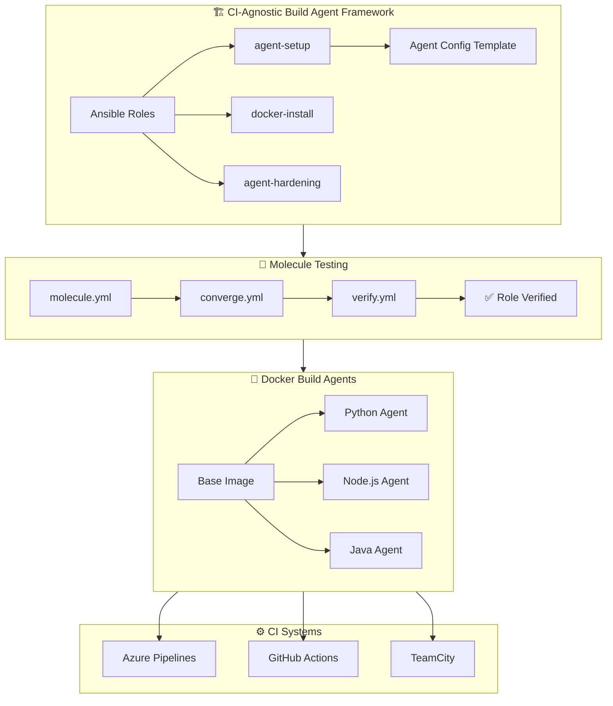

# CI-Agnostic Build Agent Framework

### A self-hosted build agent framework that works across
### Azure Pipelines · GitHub Actions · TeamCity — without changing your agent code

<br/>


<br/>

</div>

---

## 🎯 The Problem

Most build agent setups are **tightly coupled to a single CI system**.
When your organisation runs Azure Pipelines, TeamCity, and GitHub Actions
simultaneously — you end up maintaining three separate agent setups,
three sets of scripts, and three times the toil.

This framework solves that.

---

## ✅ The Solution

A **single, CI-agnostic self-hosted build agent framework** built with
Ansible, Docker, and Python that:

- 🔁 Deploys and configures agents **identically** across CI systems
- 🧪 Tests every role change with **Molecule** before it touches production
- 🐳 Packages agents as **Docker containers** for consistency and portability
- ⚙️ Is fully **variable-driven** — swap CI target via a single config value
- 🔐 Includes **security hardening** out of the box

---

## 📊 Impact

| Metric | Before | After |
|---|---|---|
| Agent setup time | 4–6 hours manual | ~15 minutes automated |
| CI systems supported | 1 per setup | 3 from one framework |
| Projects using framework | 0 | 60+ |
| Consistency across agents | ❌ Varies by team | ✅ Identical, version-controlled |
| Security hardening | ❌ Ad hoc | ✅ Built-in, tested |

---

## 🏛️ Architecture



---

## 🚀 Quick Start

### Prerequisites
- Ansible `>= 2.14`
- Docker `>= 24.0`
- Python `>= 3.10`
- Molecule `>= 6.0` (for testing)

### 1. Clone the repo
```bash
git clone https://github.com/YOUR_USERNAME/ci-agnostic-build-agent-framework.git
cd ci-agnostic-build-agent-framework
```

### 2. Install dependencies
```bash
pip install -r agents/base/requirements.txt
ansible-galaxy install -r ansible/requirements.yml
```

### 3. Configure your target CI system
```yaml
# ansible/inventory/hosts.yml
all:
  vars:
    ci_system: github-actions   # options: github-actions | azure-pipelines | teamcity
    agent_version: "3.227.1"
    docker_enabled: true
    harden_agent: true
```

### 4. Run the playbook
```bash
ansible-playbook ansible/playbook.yml -i ansible/inventory/hosts.yml
```

### 5. Verify with the health check
```bash
python scripts/health-check.py --ci github-actions
```

---

## 🧪 Testing with Molecule

Every Ansible role is fully tested with Molecule before deployment.

```bash
# Run full Molecule test suite
cd ansible
molecule test

# Test specific role only
molecule test --scenario-name agent-setup

# Run just the verify step (faster iteration)
molecule verify
```

### What Molecule tests:
- ✅ Agent service starts correctly
- ✅ Docker daemon is running
- ✅ Required ports are open
- ✅ Security hardening applied
- ✅ Agent registers with CI system
- ✅ Idempotency (run twice = same result)

---

## 🐳 Build Agent Images

### Available agents

| Agent | Base OS | Tools included |
|---|---|---|
| `base` | Ubuntu 22.04 | Git, curl, Docker CLI, Python 3.10 |
| `python` | base | Python 3.10, pip, poetry, pytest |
| `node` | base | Node 20, npm, yarn |
| `java` | base | JDK 17, Maven, Gradle |

### Build an agent image
```bash
# Build Python agent
docker build -t build-agent:python ./agents/python

# Build all agents
docker compose build

# Run locally to test
docker run --rm build-agent:python python --version
```

---

## ⚙️ CI System Integration

### GitHub Actions
```yaml
# .github/workflows/your-pipeline.yml
jobs:
  build:
    runs-on: self-hosted          # ← uses this framework's agent
    container:
      image: your-registry/build-agent:python
    steps:
      - uses: actions/checkout@v4
      - run: python -m pytest tests/
```

### Azure Pipelines
```yaml
# azure-pipelines.yml
pool:
  name: SelfHosted-AgentPool      # ← pool provisioned by this framework

steps:
  - task: UsePythonVersion@0
    inputs:
      versionSpec: '3.10'
  - script: python -m pytest tests/
```

### TeamCity
```xml
<!-- Uses agent provisioned by this framework -->
<build-runner name="pytest" type="python">
  <parameters>
    <param name="python.executable" value="/usr/bin/python3" />
  </parameters>
</build-runner>
```

---

## 🔐 Security Hardening

The `agent-hardening` role applies the following out of the box:

- 🔒 Non-root user for agent process
- 🔒 Read-only filesystem where possible
- 🔒 Minimal base image (no unnecessary packages)
- 🔒 Secrets via environment variables only (no hardcoded values)
- 🔒 Network policies — agent only talks to CI system endpoint
- 🔒 Docker socket access scoped to agent user only

---

## 📁 Key Files Explained

| File | Purpose |
|---|---|
| `ansible/roles/agent-setup/tasks/main.yml` | Core agent installation and registration |
| `ansible/roles/agent-setup/templates/agent.conf.j2` | Jinja2 config template — one file, all CI systems |
| `ansible/molecule/default/verify.yml` | All assertions that prove the role works |
| `scripts/bootstrap.sh` | One-liner to set up a new agent host from scratch |
| `scripts/health-check.py` | Post-deploy validation script |
| `ci-configs/` | Drop-in pipeline configs for each CI system |

---

## 🗺️ Roadmap

- [x] Azure Pipelines support
- [x] GitHub Actions support
- [x] TeamCity support
- [x] Molecule test suite
- [x] Security hardening role
- [ ] AWS CodeBuild support
- [ ] GitLab CI support
- [ ] Kubernetes-native agent (AKS / EKS)
- [ ] Helm chart for K8s deployment
- [ ] Prometheus metrics endpoint on agent

---

## 🤝 Contributing

Contributions welcome! Please read [CONTRIBUTING.md](CONTRIBUTING.md) first.

```bash
# Run tests before submitting a PR
molecule test
pytest tests/
```

---

## 📄 License

MIT — see [LICENSE](LICENSE)

---

<div align="center">

**Built by [Megha Bansal](https://linkedin.com/in/meghabansaldevops)**
Senior Platform Engineer | Munich, Germany

⭐ Star this repo if it saved you time!

</div>
