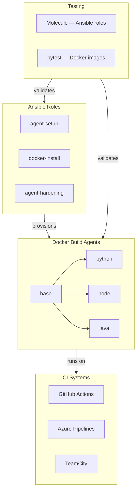

# CI-Agnostic Build Agent Framework

<div align="center">

### One framework. Three CI systems. Zero duplication.


</div>

---

## Why I built this

In most organisations running more than one CI system, build agent setup becomes a mess fast.
You end up with one Ansible playbook for GitHub Actions, a different set of scripts for Azure
Pipelines, something cobbled together for TeamCity, and three times the maintenance burden.

I wanted a single framework that provisions identical agents across all three — where the only
thing you change is one variable: `ci_system`.

---

## What it does

- Provisions self-hosted build agents via **three Ansible roles** — setup, Docker install, and security hardening
- Packages agents as **Docker images** (base, Python, Node, Java) so the runtime environment is consistent regardless of host
- Every role is **fully tested with Molecule** — including idempotence checks — before anything touches a real machine
- A **GitHub Actions CI pipeline** lints Dockerfiles, builds all images, and runs pytest on every push
- Drop-in **ci-config templates** for GitHub Actions, Azure Pipelines, and TeamCity so teams can onboard quickly

---

## Architecture



The three Ansible roles are deliberately separate. docker-install and agent-hardening are reusable on any Linux host — not just build agents. Each role has its own Molecule test suite so failures are isolated and easy to debug.

## Quick start
Prerequisites: Ansible >= 2.15, Docker >= 24.0, Python >= 3.10
```bash
  # Clone and set up
git clone https://github.com/megha910825/ci-agnostic-build-agent-framework.git
cd ci-agnostic-build-agent-framework
python3 -m venv venv && source venv/bin/activate
pip install -r requirements.txt
ansible-galaxy collection install -r ansible/requirements.yml

# Build all Docker agent images
docker compose build

# Provision an agent host — set ci_system to your target
ansible-playbook ansible/playbook.yml \
  -i your-host-ip, \
  -e "ci_system=github-actions" \
  -e "agent_token=YOUR_TOKEN"

# Check it worked
python3 scripts/health-check.py --ci github-actions

```
> Note: Full image builds run cleanly in GitHub Actions CI. Local builds on corporate networks may fail if SSL is intercepted — this does not affect images built in CI.

## Docker agent images

| Image | Base | What's included |
|-------|------|-----------------|
| `build-agent:base` | Ubuntu 22.04 | git, curl, Docker CLI, Python 3 |
| `build-agent:python` | `base` | pytest, black, flake8, mypy, bandit |
| `build-agent:node` | `base` | Node 20, npm |
| `build-agent:java` | `base` | JDK 17, Maven |


All images run as a non-root agent user. The base image is the foundation — the others extend it so you only pay the apt-get cost once.

## Testing
There are two layers of tests.

Molecule tests the Ansible roles — does the agent user get created, is the service configured correctly, are file permissions right, and does the role pass idempotence (running it twice produces zero changes).

pytest tests the Docker images — is git installed, does the container run as non-root, can the Python image actually execute pytest, can the Java image compile and run a class.

```bash
  # Test a specific Ansible role
cd ansible/roles/agent-hardening
molecule test

# Test all Docker images (requires images to be built first)
pytest tests/ -v

```
I hit two real idempotence bugs during development worth mentioning:

A {{ ansible_date_time.iso8601 }} timestamp in a Jinja2 template — regenerated the file on every run. Fixed by removing the timestamp from the template.
file module with recurse: true — rescans every file on every run and always reports changed. Fixed by removing recurse and handling ownership separately with changed_when: false.
Molecule caught both before they reached a real machine.

## CI system integration
Copy the relevant template from ci-config/ into your project and adjust the pool name, image, and secrets to match your setup.

GitHub Actions — use ci-config/github-actions/build-agent-job.yml
```yaml
  jobs:
  build:
    runs-on: self-hosted
    container:
      image: build-agent:python
    steps:
      - uses: actions/checkout@v4
      - run: pytest tests/ -v

```
Azure Pipelines — use ci-config/azure-pipelines/build-agent-job.yml
```yaml
pool:
  name: SelfHosted-AgentPool
steps:
  - script: pytest tests/ -v

```
TeamCity — see ci-config/teamcity/build-agent-setup.xml for agent capability properties and registration instructions.

## Security hardening
The agent-hardening role is a standalone role — it works on any Ubuntu host, not just build agents. It applies:

- SSH password authentication disabled
- fail2ban installed and enabled
- UFW firewall — deny by default, SSH allowed
- Agent work directory at 0750, config file at 0600
- Agent process runs as a dedicated non-root system user
- Tokens passed at runtime via -e flags or CI secrets — nothing sensitive committed

## Operational scripts

| Script | What it does |
|--------|--------------|
| [`scripts/bootstrap.sh`](scripts/bootstrap.sh) | Sets up a fresh Ubuntu host from scratch — installs Docker, Python, Ansible, then runs the playbook |
| [`scripts/health-check.py`](scripts/health-check.py) | Post-deploy validation — checks agent service, Docker daemon, work directory, and config file |
| [`scripts/cleanup.sh`](scripts/cleanup.sh) | Stops the agent, removes the work directory, optionally removes Docker images |


```bash
# Bootstrap a fresh host
CI_SYSTEM=github-actions AGENT_TOKEN=xxx bash scripts/bootstrap.sh

# Check agent health
python3 scripts/health-check.py --ci github-actions

# Clean up everything
bash scripts/cleanup.sh --all

```
## What's built and what's next

- [x] GitHub Actions support
- [x] Azure Pipelines support
- [x] TeamCity support
- [x] Molecule test suite — all three roles
- [x] Security hardening role
- [ ] GitLab CI support
- [ ] AWS CodeBuild support
- [ ] Kubernetes-native agent (AKS / EKS)
- [ ] Helm chart
- [ ] Prometheus metrics endpoint

## License
MIT — see LICENSE

<div align="center">
Built by Megha Bansal — Senior Platform Engineer, Munich

⭐ If this saved you time, a star is appreciated!

</div>
